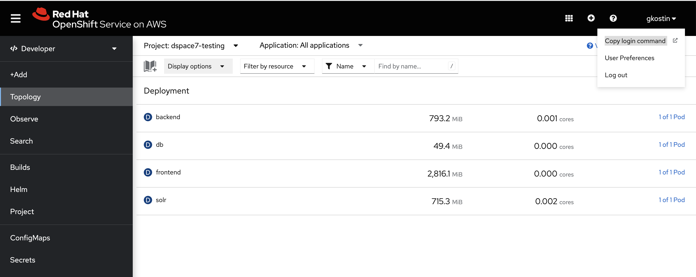
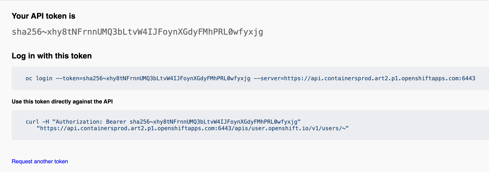
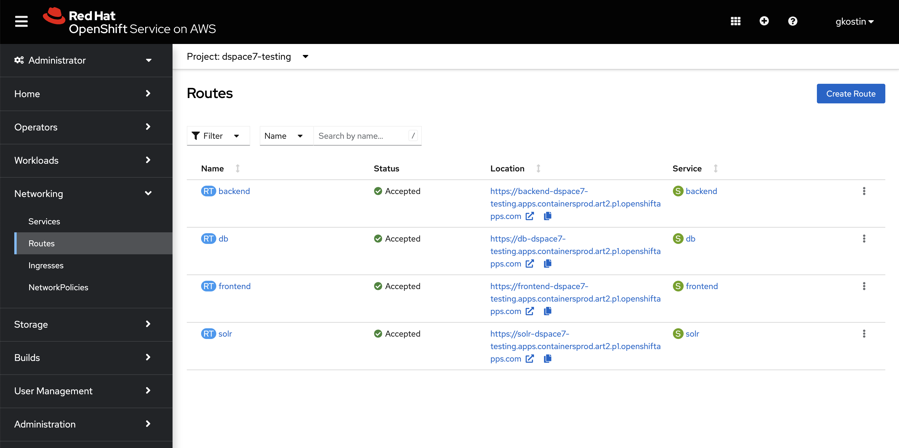

## Building and running remotely

DSpace is hosted in the Michigan Information and Technology Services [Container Service](https://its.umich.edu/computing/virtualization-cloud/container-service/).
### build
Run the GitHub action workflows in the following order to build the images that will be deployed to the container service.

| Workflow                                                                                                                        | Packages                                                                                 |
|---------------------------------------------------------------------------------------------------------------------------------|------------------------------------------------------------------------------------------|
| [1. Build dspace source image](https://github.com/mlibrary/dspace-containerization/actions/workflows/build-source-image.yml)    | dspace-source:`tag`                                                                      |
| [2. Build dspace images](https://github.com/mlibrary/dspace-containerization/actions/workflows/build-dspace-images.yml)         | dspace-frontend:`tag`, dspace-backend:`tag`, dspace-solr:`tag`, dspace-db:`tag`          |
| [3. Build dspace uid images](https://github.com/mlibrary/dspace-containerization/actions/workflows/build-dspace-uid-images.yml) | dspace-frontend:**uid**, dspace-backend:**uid**, dspace-solr:**uid**, dspace-db:**uid**  |
### login
The [OpenShift Client (oc)](https://docs.openshift.com/container-platform/4.13/cli_reference/openshift_cli/getting-started-cli.html) will be used to deploy the images to [MITS Red Hat OpenShift Service on AWS](https://containers.aws.web.umich.edu/). Log in to the [dspace7-testing](https://console-openshift-console.apps.containersprod.art2.p1.openshiftapps.com/topology/ns/dspace7-testing?view=list) project (namespace) and click on the "Copy login command" link in the drop down menu under your unique login name in the upper right hand corner of the webpage.  to get your "Display Token" link (click on the link)  and execute the "Log in with this token" oc login command.
```
$ oc login --token=sha256~xpONnGYkpozoP7kyXEneEMInUg3u8ny9_OoB8JS3pmc --server=https://api.containersprod.art2.p1.openshiftapps.com:6443

Logged into "https://api.containersprod.art2.p1.openshiftapps.com:6443" as "gkostin" using the token provided.

You have access to the following projects and can switch between them with 'oc project <projectname>':

  * archivesspace
    dspace7-testing

Using project "archivesspace".
```
You may need to change your `oc project` to point to the `dspace7-testing` project (namespace).
```shell
oc project dspace7-testing
```
like so
```
$ oc project dspace7-testing
Now using project "dspace7-testing" on server "https://api.containersprod.art2.p1.openshiftapps.com:6443".
```
### deploy
From your local dspace-containerization directory apply the dspace-uid deployment files.
#### database
```shell
oc apply -f dspace-uid/db-deployment.yml
```
#### solr
```shell
oc apply -f dspace-uid/solr-deployment.yml
```
#### apache
```shell
oc apply -f dspace-uid/apache-deployment.yml
```
#### backend
```shell
oc apply -f dspace-uid/backend-deployment.yml
```
https://wiki.lyrasis.org/display/DSDOC7x/Configuration+Reference#ConfigurationReference-ConfigurationSchemeforReloadingandOverriding
#### frontend
```shell
oc apply -f dspace-uid/frontend-deployment.yml
```
https://wiki.lyrasis.org/display/DSDOC7x/User+Interface+Configuration#UserInterfaceConfiguration-In7.2orabove

NOTE:
* The frontend takes its time coming up so be patient and view the logs.
* The frontend using a lot of memory, if you need more bump up the "--max-old-space-size=8192".
### routes
From the Administrator OpenShift console  under `Networking -> Routes` create the following routes by clicking the create route button.

| Name     | Path  | Service  | Target port      | Secure Route       |
|----------|-------|----------|------------------|--------------------|
| frontend | /     | frontend | 4000->4000 (TCP) | true:Edge:Redirect |
| db       | /     | db       | 5432->5432 (TCP) | true:Edge:Redirect |
| backend  | /     | backend  | 8080->8080 (TCP) | true:Edge:Redirect |
| apache   | /     | apache   | 8888->8888 (TCP) | true:Edge:Redirect |
| solr     | /solr | solr     | 8983->8983 (TCP) | true:Edge:Redirect |


### remotehost

| URL                                                                                  | service  | comment               |
|--------------------------------------------------------------------------------------|----------|-----------------------|
| https://frontend-dspace7-testing.apps.containersprod.art2.p1.openshiftapps.com/      | frontend | Angular GUI           |
| https://backend-dspace7-testing.apps.containersprod.art2.p1.openshiftapps.com/server | backend  | Server API            |
| https://backend-dspace7-testing.apps.containersprod.art2.p1.openshiftapps.com/rest   | backend  | REST API (deprecated) |
| https://apache-dspace7-testing.apps.containersprod.art2.p1.openshiftapps.com/        | apache   | Perl CGI              |
| https://solr-dspace7-testing.apps.containersprod.art2.p1.openshiftapps.com/solr      | solr     | Solr GUI              |
| https://db-dspace7-testing.apps.containersprod.art2.p1.openshiftapps.com/            | db       | PostgreSQL            |

NOTE: Connecting to the database require GSSAPI configuration of your `psql` client (which is a mystery to me and you are on your own), otherwise just use port-forwarding:
#### port-foward terminal
```shell
oc port-forward service/db 5432:5432
```
#### psql client terminal
```shell
psql -h localhost -d dspace -U dspace
```
